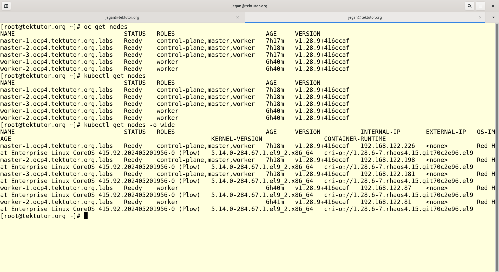

# Day 1

## What is Boot Loader ?
- When we boot Laptop/Desktop/Workstation/Server, the BIOS it will perform POST (Power On Self Test)
- Once the BIOS POST operations are completed, the BIOS will instruct the CPU to load the Boot Loader utility that is installed on the Master Boot Record (MBR - Sector 0 Byte 0 on the Hard disk).
- It is tiny appliction which has to fit within 512 bytes
- Boot loader is the one which scans your hard disks looking for Operating systems installed and boots the OS
- Every OS whether it is Windows/Linux it will install the Boot Loader at the end of the OS installtion
- In case the MBR is corrupted then your OS will not boot at all
- Examples
  - LILO ( Linux Loader )
  - GRUB 2 - Stable boot loader generally used in all Linux Distributions
  - BootCamp - commercial boot loader used on the Mac Laptops/Desktops

## What is Dual/Multi-booting?
- In case, you have installed 2 or more OS on the same laptop/desktop, then the boot loader utility gives a menu asking which OS you want to boot into
- In case you have multiple OS, only one OS can be active at any point of time
- If you wish to boot into the other OS, you need to shutdown the currently running OS

## What is Hypervisor?
- is virtualization technology
- we can run multiple OS on the same laptop/desktop/workstation/server
- many OS can be actively running at the same time on the same machine
- AMD Processor
  - the virtualization feature set is called AMD-V
- Intel Processor
  - the virtualization feature set is called VT-X
- need hardware and BIOS support to install Hypervisor(Virtualization) software
- each Virtual Machine represents 1 OS
- In case laption/desktop/workstation, we generally install Type 2 Hypervisor
- Type 2 Hypervisors require a Host OS installed on the machine
- The Virtualization software is installe on top of the Host OS
- The additional OS that we install are called Guest OS, which runs within a Virtual Machine
- In case of Servers, we can install Type 1 Hypervisor a.k.a Bare metal hypervisors
- Bare metal hypervisors doesn't require a OS to be installed to create virtual machine
- Type 1 Hypervisor Example
  - VMWare vSphere/vCenter
- Type 2 Hypervisors Examples
  VMWare (Paid - Commercial Product )
    - Fusion ( installed top of Mac OS-X )
    - Workstation ( installed on top of Windows/Linux )
  Oracle Virtualbox ( installed on top of Mac/Windows/Linux - Free but not opensource )
- KVM - Free & Opensource Hypervisor works on all Linux Distributions
- This type of virtualization is called heavy-weight Virtualization
  - the reason for saying heavy-weight is because each Virtual Machines has to be allocated with dedicated hardware resources
    - CPU Cores (virtual cores )
    - RAM - Actual size
    - Network Card ( virtual )
    - Graphics Card ( virtual )
    
## What is the deciding factor that limits the maximum number of Virtual Machines we can create on a machine?
- Processor - supports multiple CPU Cores
- depends on how many virtual CPU cores your system supports
- modern Processor with 4 Physical Cores are seen as 8 Virtual Cores by the Virtualization software
- Which mean on a laptop with 4 Physical CPU Cores, you can run 1 Host OS and 7 Virtual Machine

## Docker Overview
- is an application virtualization technology
- unlinke the Hypervisor technology, this is light weight virtualization
- why light-weight?
  - because container's don't use dedicated hardware resources
  - all the containers that runs on the same host machine shares the hardwares on the host OS
  - containers are not Operating System
  - containers doesn't have their own OS Kernel
- containers get's their own IP Address
- each container represents one application or one application component ( backend, frontend, web/app server, db server, etc )
- each container runs in a separate namespace
- containers are otherwise a normal application process
- Docker comes 2 flavours
  1. Docker Community Edition - Docker CE
  2. Docker Enterprise Edition - Docker EE
- Docker is developed in Go language by the company Docker Inc
- follows client/server architecture
- the server runs in the OS Kernel context (administrator), hence most container we create we will gain admin access within the containers, even in the case the user who created the container is a non-admin user

## Podman Overview
- Podman is alternate to Docker
- Podman is also opensource maintained by Community headed by Red Hat
- stand-alone tool unlike Docker
- supports creating root-less container i.e running application as normal user ( non-admin users )

## What is a Container Image?
- is a binary file that has software pre-installed in it
- it comes with package manager like apt(apt-get),yum,rpm,dnf,etc.,
- containers are created using Container Image
- Example
  - Windows 11 ISO Disk Image,
  - similary we have ubuntu:16.04 container image
  - similarly we have nginx:1.18 is the Container Image that comes with nginx web server v1.18 pre-installed in it
- When we create a nginx container using nginx:1.18 container image, the container by default runs the nginx web server within it
- using container images, we can create any number of container
- containers are the running instances of the container image
- containers get an IP address
  
## Container Orchestration Overview
- though containerized application workloads can be manually managed, in real-world no organization manages containers manually
- generally containerized applications are managed by Container Orchestration Platforms
- Examples
  - Docker SWARM
  - Google Kubernetes
  - AWS EKS - Elastic Kubernetes Service ( Managed K8s Cluster from Amazon AWS)
  - Azure AKS - Azure Kubernetes Service ( Managed K8s Cluster from Microsoft Azure)
  - Rancher Kubernetes ( Kubernetes + Rancher Webconsole )
  - Red Hat OpenShift
  - AWS ROSA - Managed Red Hat OpenShift Cluster from Amazon AWS 
  - Azure ARO - Managed Red Hat OpenShift cluster from Microsoft Azure

## Docker SWARM
- Docker Inc's native Orchestration Platform
- supports only Docker containerized application workloads
- easy to install on regular laptops/desktops
- light-weight
- good for learning purpose, dev/qa environment
- not used in production

## Google Kubernetes
- opensource and free Container Orchestration Platform developed and maintained by Opensource community led by Google
- supports many different Container Runtimes - e.g Docker, containerd, Podman
- also supports extending Kubernetes API by adding your own Custom Resources and Custom Controller
- supports packaging Custom Resources and Custom Controllers as Kubernetes Operators to extend Custom Kubernetes additional features
- generally Command-line only
- there is minimal Kubernetes Dashboard (webconsole) which doesn't support user management hence result in security issue, so normally organizations disable the Kubernetes dashboard
- Kubernetes doesn't support internal container registry out of the box, but can be configured to use external container registry

## Red Hat OpenShift
- Red Hat's Kubernetes distribution
- Kubernetes + Many additional features developed on top of opensource Kubernetes
- all the features supported in Kubernetes also works in OpenShift
- OpenShift added many additional features on top of Kubernetes
- supports CLI and Web Console(GUI)
- comes with Internal Openshift Container Registry
- supports CI/CD within Openshift
- supports additional Custom Resources in Openshift
  - DeploymentConfig
  - Route
- self-healing platform
- supports in-built monitoring features
- supports in-built load-balancing
- supports high-availability for your applications deployed within Kubernetes/Openshift
- supports exposing your application only within the openshift cluster or outside the openshift cluster via services
- supports rolling update
- supports scaling up/down your application instance counts

## Commonly Used OpenShift resources
- Pod
- ReplicaSet
- Deployment

## What is OpenShift Cluster?
- OpenShift cluster is a collection of many machines
- each machine is referred as node in the Kubernetes/Openshift
- each node is either of type of Master or Worker
- Master nodes runs the Control Plane components
  - API Server
  - etcd database
  - scheduler
  - controller managers
- Worker nodes runs the user containerized application workloads

## API Server
- this is a collection of all the Kubernetes/Openshift features in the form of REST APIs
- the client tools like oc/kubectl/kn/odo/helm will communicate to the API Server by making REST calls
- API Server saves the cluster status and application status in the etcd key/value database
- API Server is the only component that has access to the etcd databaase
- all the components in openshift will only communicate to API Server
- no two components are allowed to talk to each other directly, every communication happens only via API Server
- API Server sends broadcasting events each time
  - new record is inserted into the etcd database
  - an existing is modified
  - an existing is deleted
    
## etcd database
- is an opensource key-value database used in Kubernetes/openshift
- can be used outside the scope of kubernetes/openshift as well
- normally works as a cluser of many etcd db nodes
- data gets synchronized when many etcd db servers works as a cluster
- one of the reasons why openshift recommends minimum 3 masters is due to the reason etcd requires/recommends a minimum of 3 nodes in the cluster

## Scheduler
- this is the component that is responsible to find a healthy node where a new Pod can be deployed
- scheduler shares the scheduling recommendation about each Pod by making REST calls
- API Server sends broadcasting events whenever a new Pod is created in the etcd database
- API Server sends broadcasting events whenever a Pod is deleted in the etcd database
- API Server sends broadcasting events whenever a Pod status changes ( for example -crashloop )

## Controller Managers
- this is a collection of many Controllers
- For example
  - Deployment Controller
  - ReplicaSet Controller
  - StatefulSet Controller
  - DaemonSet Controller
  - Job Controller
  - CronJob Controller
  - Endpoint Controller
  - Storage Controller

## What is a Pod?
- a collection of related containers
- each container represents one application or one application component
- Pod is the small unit that can be deployed in Kubernetes/OpenShift
- one application per Pod is the recommended best practice
- IP address is assigned on the Pod level, not on the container level
- hence, every container that is part of the same Pod shares the same IP address
- Pod is yaml/json resource that lives in etcd database
- the containers associated to the Pod runs in any nodes within the Openshift cluster

## What is ReplicaSet?
- Replicaset is a resource that is stored and maintained in etcd database by API Server(Control Plane)
- ReplicaSet tells what is the desired number of Pods that be running at any point of time within Kubernetes/OpenShift
- ReplicaSet is managed by a controller called ReplicaSet Controller
- Scale up/down is suppored by ReplicaSet Controller

## What is Deployment
- Deployment is a resourced stored and maintained in etcd database by API Server
- for each application we deploy in Openshift, a deployment will be created
- Deployment is managed by a controller called Deployment Controller
- the deploy has
  - an unique name
  - desired number of Pods that should be running
  - container image that must be used to deploy the Pod containers
- Rolling update is supported by Deployment Controller
- 
## What is a Controller?
- is a application that runs in a infinite loop
- it keeps looking for specific type of resources created within Openshift cluster in any namespace/project
- it has some special permissions to monitor certain resources in any project/namespace
- For example
  - Deployment Controller can detect Deployment resources created/edited/deleted/scaled up/down in any namespace/project
  - ReplicaSet Controller can detect ReplicaSet resources created in any namespace/project

## What is a Master Node in Kubernetes/Openshift?
- In master node, control-plane components will be running
- Control Plane
- Control Planes components they provide the orchestration features
- Control Planes monitors, heals, manages the user-application deployed in the openshift
- wherever control plane components are running they are called master nodes
- In normal configurations, the user application won't be running/scheduled into master nodes
- In special cases, we can configure the master nodes to accept user application getting deployed into master nodes by removing the tains(conditions/restrictions)
- In our lab setup, user application will be deployed onto master as well as worker nodes
- master nodes are also called as controller nodes

## What is a Worker Node in Kubernetes/Openshift?
- Worker Nodes is where user applications will be deployed
- there can any number of worker nodes
- worker nodes are also called as compute nodes

## Lab - Listing the nodes in the Openshift cluster
```
oc get nodes
oc get nodes -o wide
```

Expected output



## Info - How the oc or kubectl learns the connection details to openshift cluster
<pre>
- In the user home directory, there is hidden .kube folder which has the config file
- In my case, /home/jegan/.kube/config is the location oc or kubectl will first search for the config file
- It is also possible we could export an environment variable KUBECONFIG to point to the location of the config file
- An alternate approach is to supply a switch in the command-line to point the config file location
</pre>

Expected output


## Lab - Finding more details about an openshift node
```
oc get nodes
oc describe node/master-1.ocp4.tektutor.org.labs
oc describe node master-1.ocp4.tektutor.org.labs
```

Expected output


## Lab - Editing a node - don't modify anything :)
```
oc get nodes
oc edit node/worker-1.ocp4.tektutor.org.labs
```

## Info - Openshift Projects
<pre>
- In order to seggreate the application deployments made by different teams, namespaces or projects are created
- For each team, atleast one project is created, so that multiple engineers can work together
- many applications can deployed into a single openshift project
- Administrators can give access to projects the developers are working in, while denying access to other users
- it is always recommended to create a separate before we deploy our applications
- training specific request - each user can create one project in your name
</pre>

## Lab - Listing the projects in openshift
```
oc get namespaces
oc get namespace
oc get ns

oc get projects
oc get project
```

Expected output
[projects](project.png)
