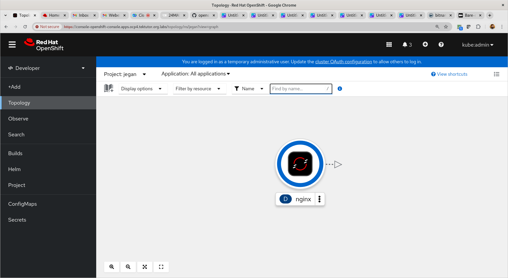

# Day 2

## Lab - Deploying nginx in declarative style
```
cd ~
oc create deployment nginx --image=bitnami/nginx:1.18 -o yaml --dry-run=client
oc create deployment nginx --image=bitnami/nginx:1.18 -o yaml --dry-run=client > nginx-deploy.yml
oc apply -f nginx-deploy.yml
oc get deploy,rs,po
```

Expected output




## Lab - Generating declarative manifest scripts for clusterip, nodeport and loadbalancer services
```
oc get deploy
oc expose deploy/nginx --type=ClusterIP --port=8080 -o yaml --dry-run=client
oc expose deploy/nginx --type=ClusterIP --port=8080 -o yaml --dry-run=client > nginx-clusterip-svc.yml
oc expose deploy/nginx --type=NodePort --port=8080 -o yaml --dry-run=client > nginx-nodeport-svc.yml
oc expose deploy/nginx --type=LoadBalancer --port=8080 -o yaml --dry-run=client > nginx-lb-svc.yml
ls
```

Expected output


## Lab - Creating clusterip internal service in declarative style
```
oc expose deploy/nginx --type=ClusterIP --port=8080 -o yaml --dry-run=client > nginx-clusterip-svc.yml
ls -l
oc apply -f nginx-clusterip-svc.yml
oc get svc
```

You can also delete the service in declarative style
```
oc delete -f nginx-clusterip-svc.yml
oc get svc
```
Expected output


## Lab - Creating nodeport external service in declarative style
```
oc expose deploy/nginx --type=NodePort --port=8080 -o yaml --dry-run=client > nginx-nodeport-svc.yml
ls -l
oc apply -f nginx-nodeport-svc.yml
oc get svc
```

You can also delete the service in declarative style
```
oc delete -f nginx-nodeport-svc.yml
oc get svc
```
Expected output


## Lab - Creating loadbalancer external service in declarative style
```
oc expose deploy/nginx --type=LoadBalancer --port=8080 -o yaml --dry-run=client > nginx-lb-svc.yml
ls -l
oc apply -f nginx-lb-svc.yml
oc get svc
```

You can also delete the service in declarative style
```
oc delete -f nginx-lb-svc.yml
oc get svc
```

Expected output


## Lab - Scaling up/down deployment in declarative style

Scale up the nginx deployment from 3 pods to 5 pods.  You need to edit the nginx-deploy.yml file, replace the replicas from 3 to 5, save and apply as shown below.
```
cd ~/openshift-3june-2024
git pull
cd Day2/declarative-manifest-scripts
cat nginx-deploy.yml
oc get po
oc apply -f nginx-deploy.yml
oc get po
```

Expected output


Scale down the nginx deployment from 5 pods to 3 pods.  You need to edit the nginx-deploy.yml file, replace the replicas from 5 to 3, save and apply as shown below.
```
cd ~/openshift-3june-2024
git pull
cd Day2/declarative-manifest-scripts
cat nginx-deploy.yml
oc get po
oc apply -f nginx-deploy.yml
oc get po
```

Expected output


