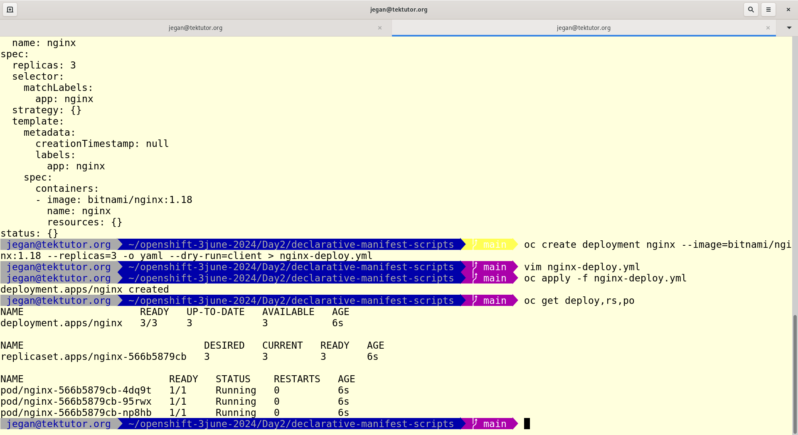
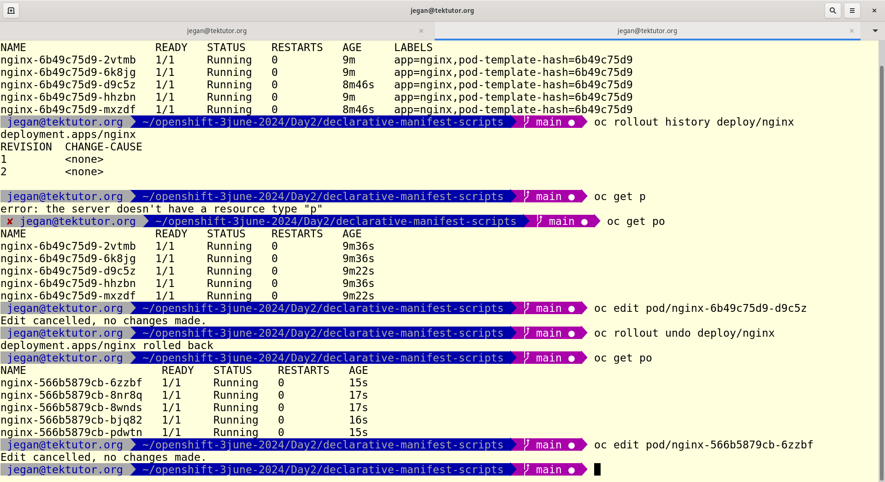

# Day 2

## Lab - Deploying nginx in declarative style
```
cd ~
oc create deployment nginx --image=bitnami/nginx:1.18 -o yaml --dry-run=client
oc create deployment nginx --image=bitnami/nginx:1.18 -o yaml --dry-run=client > nginx-deploy.yml
oc apply -f nginx-deploy.yml
oc get deploy,rs,po
```

Expected output




## Lab - Generating declarative manifest scripts for clusterip, nodeport and loadbalancer services
```
oc get deploy
oc expose deploy/nginx --type=ClusterIP --port=8080 -o yaml --dry-run=client
oc expose deploy/nginx --type=ClusterIP --port=8080 -o yaml --dry-run=client > nginx-clusterip-svc.yml
oc expose deploy/nginx --type=NodePort --port=8080 -o yaml --dry-run=client > nginx-nodeport-svc.yml
oc expose deploy/nginx --type=LoadBalancer --port=8080 -o yaml --dry-run=client > nginx-lb-svc.yml
ls
```

Expected output


## Lab - Creating clusterip internal service in declarative style
```
oc expose deploy/nginx --type=ClusterIP --port=8080 -o yaml --dry-run=client > nginx-clusterip-svc.yml
ls -l
oc apply -f nginx-clusterip-svc.yml
oc get svc
```

You can also delete the service in declarative style
```
oc delete -f nginx-clusterip-svc.yml
oc get svc
```
Expected output


## Lab - Creating nodeport external service in declarative style
```
oc expose deploy/nginx --type=NodePort --port=8080 -o yaml --dry-run=client > nginx-nodeport-svc.yml
ls -l
oc apply -f nginx-nodeport-svc.yml
oc get svc
```

You can also delete the service in declarative style
```
oc delete -f nginx-nodeport-svc.yml
oc get svc
```
Expected output


## Lab - Creating loadbalancer external service in declarative style
```
oc expose deploy/nginx --type=LoadBalancer --port=8080 -o yaml --dry-run=client > nginx-lb-svc.yml
ls -l
oc apply -f nginx-lb-svc.yml
oc get svc
```

You can also delete the service in declarative style
```
oc delete -f nginx-lb-svc.yml
oc get svc
```

Expected output


## Lab - Scaling up/down deployment in declarative style

Scale up the nginx deployment from 3 pods to 5 pods.  You need to edit the nginx-deploy.yml file, replace the replicas from 3 to 5, save and apply as shown below.
```
cd ~/openshift-3june-2024
git pull
cd Day2/declarative-manifest-scripts
cat nginx-deploy.yml
oc get po
oc apply -f nginx-deploy.yml
oc get po
```

Expected output


Scale down the nginx deployment from 5 pods to 3 pods.  You need to edit the nginx-deploy.yml file, replace the replicas from 5 to 3, save and apply as shown below.
```
cd ~/openshift-3june-2024
git pull
cd Day2/declarative-manifest-scripts
cat nginx-deploy.yml
oc get po
oc apply -f nginx-deploy.yml
oc get po
```

Expected output


## Lab - Rolling update to upgrade your live application from one version to other without any downtime
You need to edit nginx-deploy.yml and update the image version from 1.18 to 1.19, save it and apply
```
cd ~/openshift-3june-2024
git pull
cd Day2/declarative-manifest-scripts
cat nginx-deploy.yml
oc apply -f nginx-deploy.yml
```

To check the status of rolling update
```
oc rollout status deploy/nginx
oc rollout history deploy/nginx
```

To rollback to previous version
```
oc rollout undo deploy/nginx
```

Expected output




## Lab - Creating a replicaset in declarative style without deployment
First let's delete any deployment running
```
cd ~/openshift-3june-2024
git pull
cd Day2/declarative-manifest-scripts
oc delete -f nginx-deploy.yml
```

Let's create the replicaset
```
cd ~/openshift-3june-2024
cd Day2/declarative-manifest-scripts
cat nginx-rs.yml
oc apply -f nginx-rs
oc get deploy,rs,po
```

Once you are done, you may delete the replicaset declaratively
```
cd ~/openshift-3june-2024
cd Day2/declarative-manifest-scripts
oc delete -f nginx-rs
oc get rs,po
```

Expected output


## Lab - Creating a pod in declaratively style without replicaset and deployment
```
cd ~/openshift-3june-2024
git pull
cd Day2/declarative-manifest-scripts
cat pod.yml
oc apply -f pod.yml
oc get pod
```
Expected output


Once you are done with this exercise, you may delete the pod declaratively as shown below
```
cd ~/openshift-3june-2024
cd Day2/declarative-manifest-scripts
oc delete -f pod.yml
oc get pod
```

Expected output


## Lab - Creating a route to expose the clusterip service with a convenient public url
As we discussed, the nodeport service is neither end-user friendly nor developer friendly. Also it forces us to open ports in the firewall it leads to security issues.

Route is the solution to the nodeport service issues.  

Let's create a route
```
cd ~/openshift-3june-2024
git pull
cd Day2/declarative-manifest-scripts
ls -l
oc apply -f nginx-deploy.yml
oc apply -f nginx-clusterip-svc.yml
oc apply -f nginx-route.yml

oc get route
```

You may access the route as shown below
```
curl http://nginx-jegan.apps.ocp4.tektutor.org.labs
```

Expected output

