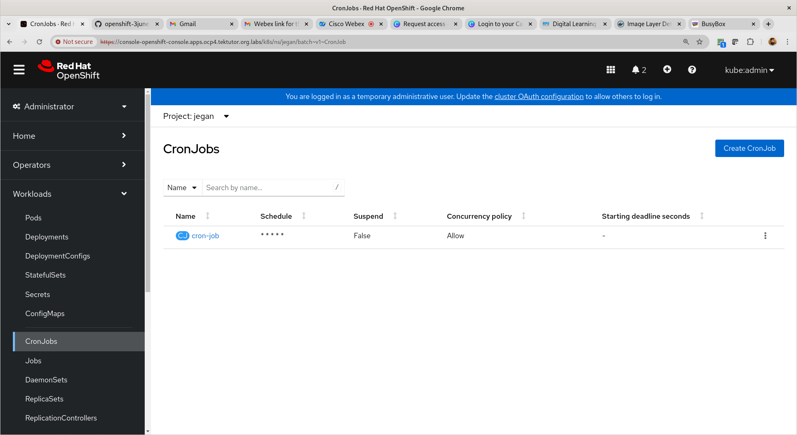

# Day 3

## Lab - Deploying multi-pod(wordpress & mariadb) wordpress application


Let's deploy wordpress and mariadb 
```
cd ~/openshift-3june-2024
git pull
cd Day3/persistent-volume/wordpress

./deploy.sh
```

Expected output


Once you are done with this exercise, you may clean up the resources
```
cd ~/openshift-3june-2024
cd Day3/persistent-volume/wordpress

./delete-all.sh
```

Expected output


## Lab - Deploying mongodb with Persistent volume
```
cd ~/openshift-3june-2024
git pull
cd Day3/persistent-volume/mongodb

oc apply -f mongodb-pv.yml
oc apply -f mongodb-pvc.yml
oc apply -f mongodb-deploy.yml
```

Expected output


## Lab - Deploying redis database with persistent volume
```
cd ~/openshift-3june-2024
git pull
cd Day3/persistent-volume/redis

oc apply -f redis-pv.yml
oc apply -f redis-pvc.yml
oc apply -f redis-deploy.yml
```

Expectd output


You may delete the redis deployment once you are done with this exercise.
```
cd ~/openshift-3june-2024
cd Day3/persistent-volume/redis

oc delete -f redis-deploy.yml
oc delete -f redis-pvc.yml
oc delete -f redis-pv.yml

oc get po,pv,pvc
```

Expected output


## Lab - Using configmap and secrets to store configuration data and credentials in secrets

#### Things to note
<pre>
- config map is used to store non-sensitive data
- config map can store many key/value pairs
- For example
  - We can store the JAVA_HOME=/usr/lib/jdk11 path 
  - We can store application log path
- secret is also a map that can store several key pairs
- the only difference between configmap and secret is , the values stores in secrets is opaque, hence we can securely store passwords, retrieve them on need basis and use them in our application
</pre>

Let's understand how to practically use configmap and secrets in the wordpress & mariadb deployments
```
cd ~/openshift-3june-2024
git pull
cd Day3/configs-and-secrets/wordpress

./deploy.sh
oc get po,pv,pvc,svc,route
```

Expected output


Once you are done with this lab exercise, you may clean up the resources as shown below
```
cd ~/openshift-3june-2024
cd Day3/configs-and-secrets/wordpress

./delete-all.sh
oc get po,pv,pvc,svc,route
```

Expected output


## Info - Helm Overview
<pre>
- Helm is a package manager that can be used to package your kubernetes/openshift cloud native applications
- Just like package managers like apt(apt-get), yum, rpm, dnf, npm, pip are used to install,uninstall, update/upgrade softwares, we can use Helm package manager to install/uninstall/upgrade applications into Kubernetes/Openshift
- Helm is also intergrated with Openshift
- Helm packaged applications are called Charts
- Helm chart is a tar.gz compressed that follows a specific folder structure within the compressed file
</pre>


## Lab - Creating a custom helm chart for our wordpress application deployment
```
cd ~/openshift-3june-2024
git pull
cd Day3/helm

helm version
helm create wordpress
tree wordpress

cd wordpress/templates
rm -rf *
cd ../..
cp manifest-scripts/*.yml wordpress/templates
cp values.yaml wordpress
tree wordpress
```

Let's create a wordpress helm chart package
```
cd ~/openshift-3june-2024
cd Day3/helm
ls
helm package wordpress
ls
```

Installing helm wordpress chart into openshift
```
cd ~/openshift-3june-2024
cd Day3/helm
ls
helm install wp wordpress-0.1.0.tgz
helm list
```

Expected output


## Info - DaemonSet Overview
<pre>
- In case, we need one Pod deployed in every node we can choose to deploy the application as a DaemonSet
- The DaemonSet controller, check the number of nodes available in the openshift cluster accordingly it will create so many Pods and deploy them one Pod per node
- In case new nodes join the openshift cluster, the DaemonSet controller automatically add one Pod on that new node as well
- On the similar line, in case when nodes are removed from the openshift cluster, the Pods on those nodes are removed automatically
- We can't manually scale up/down a DaemonSet
- Examples
  - One kube-proxy Pod runs in every node which is a DaemonSet
  - default-dns Pod runs in every node, which is a DaemonSet
</pre>

## Lab - Deploying nginx as a daemonset
```
cd ~/openshift-3june-2024
git pull
cd Day3/daemonset
oc apply -f nginx-daemonset.yml
oc get pod -o wide
```

Expected output


## Lab - Creating a Job to do an onetime activity
For details, you may refer the official documentation
<pre>
https://docs.openshift.com/container-platform/4.15/rest_api/workloads_apis/job-batch-v1.html  
</pre>

```
cd ~/openshift-3june-2024
git pull
cd Day3/job
ls
oc apply -f job.yml
oc get jobs
oc get po -w
oc logs hello-job-8jzjp
```

Expected output


## Lab - Creating a recurring job using cronjob that be scheuled
```
cd ~/openshift-3june-2024
git pull
cd Day3/cronjob
ls
oc apply -f cronjob.yml
oc get cronjobs
oc get po -w
oc logs cron-job-28627603-wbmfb
```

Expected output




## Lab - Deploying stateful application using StatefulSet

For more details, you may refer my medium blog article here
<pre>
https://medium.com/tektutor/deploying-stateful-applications-in-kubernetes-8ffd46920b55  
</pre>

```
cd ~/openshift-3june-2023
git pull
cd Day3/statefulset

oc apply -f mongodb-pv.yml
oc apply -f mongodb-pvc.yml
oc apply -f mongodb-statefulset.yml
```

Expected output


## Info - S2I (Source to Image)
<pre>
- S2I is a new feature added in OpenShift
- S2I is not supported in Kubernetes
- In case of S2I, we can provide a GitHub, BitBucket or any version control url for openshift to clone/download the source code
- Once the source code is cloned
- In case, our GitHub repo also has a Dockerfile or a Containerfile
- atleast 3 strategies are supported, source strategy, docker strategy and pipeline strategy
- in case of source strategy, we just need to provide our application code without (Dockerfile, devfile.yaml, deploy.yaml)
- in case of source strategy, we need to mention the container image that will have all the tools required to build our application
- in case of docker strategy, we need to provide a Dockerfile or Containerfile as part of our GitHub repo along with our appliaction code
</pre>

## Lab - Deploying a spring-boot hello microservice using S2I docker strategy
```
oc new-app https://github.com/tektutor/spring-ms.git --strategy=docker
```

Expected output


