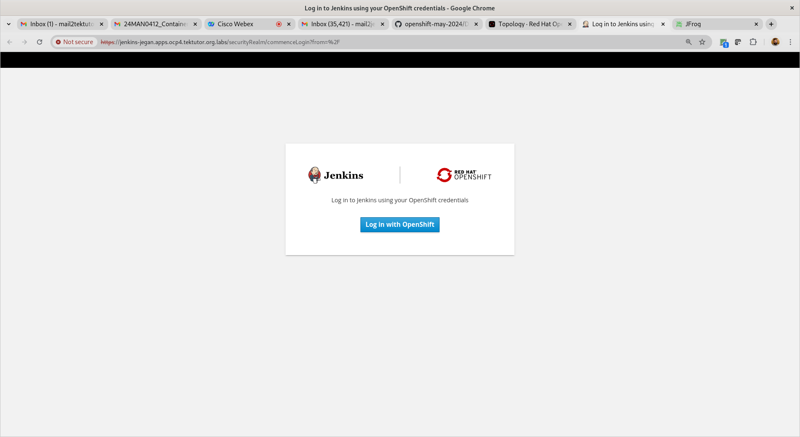
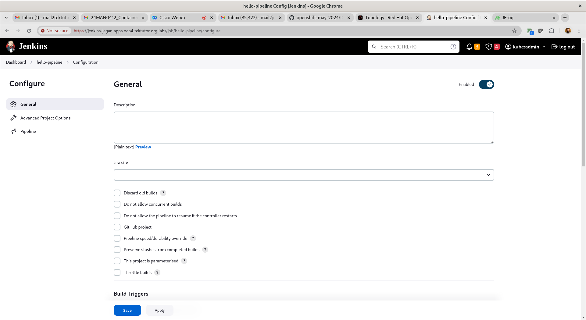
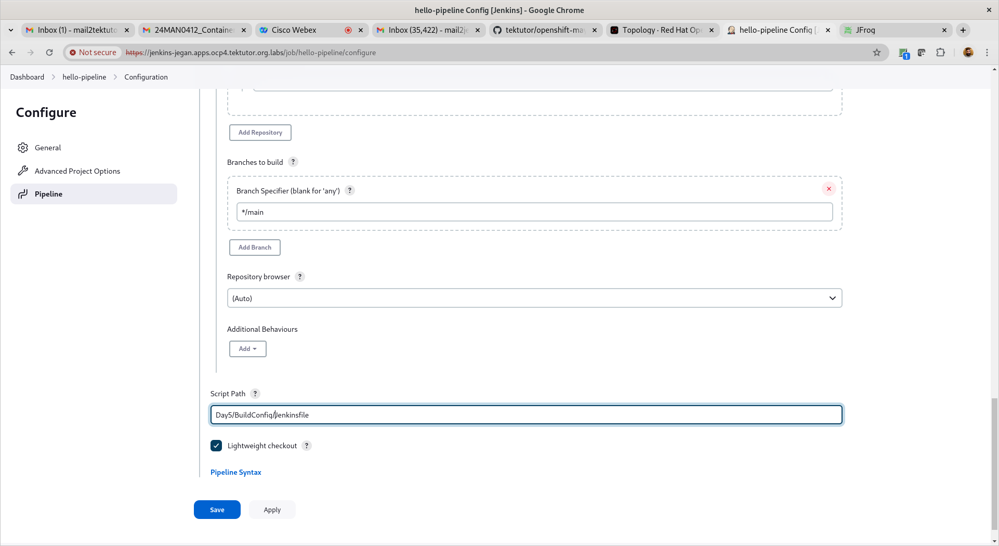

# Day 5
## Info - What is an ImageStream in OpenShift?
<pre>
- ImageStream is a resource supported only in OpenShift
- ImageStream is connected with OpenShift's Internal Private Container Image Registry
- We can store multiple versions of same container image within an ImageStream
</pre>
	

## Lab - Buildconfig 

<pre>
- This is a new feature added in Openshift and not supported in Kubernetes
- In this lab exercise, we will create an imagestream to push our custom docker image
- We will create a buildconfig using Docker strategy
- Build config with docker strategy will pick the Dockerfile present in our Day5/BuildConfig and starts the build
- The Dockerfile is a multi-stage Dockeerfile, in the first stage it builds the springboot sample microservice source code to create the application execuable jar file. The second stage copies the application jar and builds the final custom container image.
- The container image is saved to ImageStream.
- As the image stream is pointing to Openshift's Private Registry, eventually the image is stored in Openshift's Private Container Registry.
- The output of this Buildconfig is a Docker image, which will be pushed to openshift's private registry.
</pre>

Let's create an image stream
```
cd ~/openshift-3june-2024
git pull
cd Day5/BuildConfig

oc apply -f imagestream.yml
oc get imagestreams
oc get imagestream
oc get is
```

Let's create the buildconfig
```
cd ~/openshift-3june-2024
git pull
cd Day5/BuildConfig
oc delete -f buildconfig.yml
oc apply -f buildconfig.yml
oc get buildconfigs
oc get buildconfig
oc get bc

oc get builds
oc get build

oc logs -f bc/spring-hello
```
## Lab - Create a JFrog Push secret
```
oc create secret docker-registry private-jfrog-image-registry --docker-server=openshiftjegan.jfrog.io --docker-username=your-email-id --docker-password=your-jfrog-token

oc get secrets
```

## Lab - Build and Push Custom Docker Image to JFrog Artifactory using BuildConfig
```
cd ~/openshift-3june-2024

git pull
cd Day5/BuildConfig

oc apply -f buildconfig-pushto-artifactory.yml
oc get bc
oc logs -f bc/hello
```

Expected output


## CI/CD

You need to create a trial JFrog Artifactory (14-days Cloud Trial) @ https://jfrog.com/start-free/#trialOptions with your personal gmail account (No credit cards required)


You could choose AWS ( they use their cloud account hence no charges are applicable to us - I didn't give my mobile number )


Now you should be able to login to your jfrog cloud with your gmail account that your registered with JFrog trial


<pre>
jegan@tektutor.org $ docker login -u mail2tektutor@gmail.com openshiftjegan.jfrog.io
Password: 
WARNING! Your password will be stored unencrypted in /home/jegan/.docker/config.json.
Configure a credential helper to remove this warning. See
https://docs.docker.com/engine/reference/commandline/login/#credentials-store

Login Succeeded
jegan@tektutor.org $ docker pull openshiftjegan.jfrog.io/jegan-docker/hello-world:latest
latest: Pulling from jegan-docker/hello-world
Digest: sha256:266b191e926f65542fa8daaec01a192c4d292bff79426f47300a046e1bc576fd
Status: Downloaded newer image for openshiftjegan.jfrog.io/jegan-docker/hello-world:latest
openshiftjegan.jfrog.io/jegan-docker/hello-world:latest
	
jegan@tektutor.org $ docker tag openshiftjegan.jfrog.io/jegan-docker/hello-world openshiftjegan.jfrog.io/jegan-docker/hello-world:1.0.0
 jegan@tektutor.org  ~/openshift-may-2024/Day5   main  docker push openshiftjegan.jfrog.io/jegan-docker/hello-world:1.0.0
The push refers to repository [openshiftjegan.jfrog.io/jegan-docker/hello-world]
ac28800ec8bb: Layer already exists 
1.0.0: digest: sha256:d37ada95d47ad12224c205a938129df7a3e52345828b4fa27b03a98825d1e2e7 size: 524
</pre>

Deploy Jenkins Ephemeral from Develop context and login to Jenkins




Select "pipeline" project







## What does Serverless mean?
- serverless does not mean the absence of servers
- is an architecture model for running applications in an environment that is abstracted away from the developers
- developers can focus more on developing their applications than where their code runs
- in other deployment models, resources waits idle to serve requests and run regardless of whether there is work to do
- an ideal serverless workload executes a single task
- a function that retrieves data from a database can be an excellent serverless workload
- the database server is not a good serverless workload because it needs to run continuously
- serverless model is the idea of the cold start
- when using serverless, there is a period between the request and creating the pod environment. This period is the cold start.

- Examples
  - OpenShift Serverless workloads follow this workflow:
    - A request comes in
    - A pod is spun up to service the request
    - The pod services the request
    - The pod is destroyed

  - Another example of a serverless workload can be an image processing function
     - An event could be a photo upload. The uploaded photo triggers an event to run an application to process the image.
     - For example, the application may overlay text, create a banner, or make a thumbnail.
     - Once the image is stored permanently, the application has served its purpose and is no longer needed.

## Serverless Features
- Stateless Function
  - a function to query a database and return the data
  - a function to query weather report and return the data
  
- Event Driven
  - serverless model relies on a trigger to execute the code
  - could be a request to an API or an event on a queue
  
- Auto Scales to Zero
  - Being able to scale to zero means your code only runs when it needs to respond to an event.
  - Once the request is served, resources are released.

## Benefits of Serverless
- cost savings and more efficient utilization of CPU, RAM, and storage resources (better hardware utilizaton in general)
- Code is executed as needed, there is no idle time. We only pay for the execution time.
- As there is no servers to manage, no need to worry about Infrastructure management activities like
  - security updates
  - montoring
  - hardware maintenance
  - hardware upgradation, etc.,
- Scaling is easier on demand
- high availability (HA)
  
## Knative and Red Hat Serverless 

- Red Hat Serverless is based on Knative project
- Knative provides a serverless application layer on top of OpenShift/Kubernetes
- Knative consists of 3 building blocks
  1. Build
  2. Eventing
  3. Serving


## Lab - Deploying a knative service
```
kn service create hello \
--image ghcr.io/knative/helloworld-go:latest \
--port 8080
--env TARGET=World
```

Expected output


Accessing the knative application
```
curl -k https://hello-jegan.apps.ocp4.tektutor.org.labs
```

Expected output


Update the service
```
kn service update hello --env TARGET=Knative
kn revisions list
```

Expected output


Splitting the traffic between two revisions
```
kn service update hello --traffic hello-00001=50 --traffic @latest=50
kn revisions list
```

Expected output


Deleting the knative service
```
kn service list
kn service delete hello
kn service list
```

Expected output


## Lab - Knative eventing

Let's deploy a sink service
```
oc project jegan
kn service create eventinghello --concurrency-target=1 --image=quay.io/rhdevelopers/eventinghello:0.0.2
```

Expected output


Let's create an event source application
```
kn source ping create eventinhello-ping-source --schedule="*/2 * * * *" --data '{"message": "Thanks for your message"}' --sink ksvc:eventinghello
```

Expected output


## Lab - Scheduling 

Let's say our application involves loads of disk read/write, hence our application prefers nodes that has SSD disk.
- Scheduler will search for nodes that has SSD disks, if the Scheduler is able to find nodes that has SSD disks then the Pods will be
  deployed onto those nodes that has SSD disks
- In case the scheduler is not able to find nodes has SSD disk, then it would still deploy the Pods on nodes that doesn't have SSD disks in case your affinitiy type is "Preferred"
```
cd ~/openshift-3june-2024
git pull
cd Day5/scheduling
oc apply -f nginx-deploy-with-preffered-node-affinity.yml
oc get po
oc get po -o wide
```

Expected output


Let's delete the preferred Disk affinity scheduling
```
cd ~/openshift-3june-2024
git pull
cd Day5/scheduling
oc delete -f nginx-deploy-with-preffered-node-affinity.yml
```

Let's deploy the required Disk affinity scheduling
```
cd ~/openshift-3june-2024
git pull
cd Day5/scheduling
oc apply -f nginx-deploy-with-required-node-affinity.yml
```
Expected output

 
## Kindly complete the post-test from RPS Lab Machine
 
## Feedback - kindly provide your feedback here
